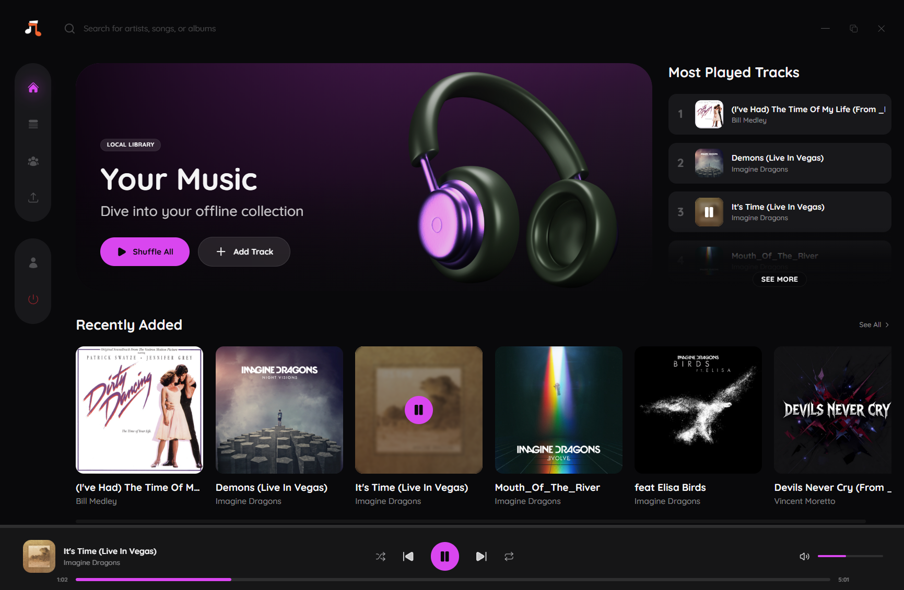
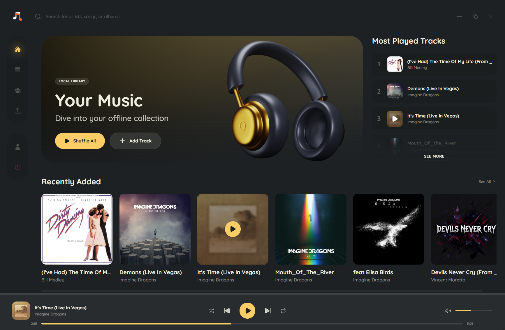
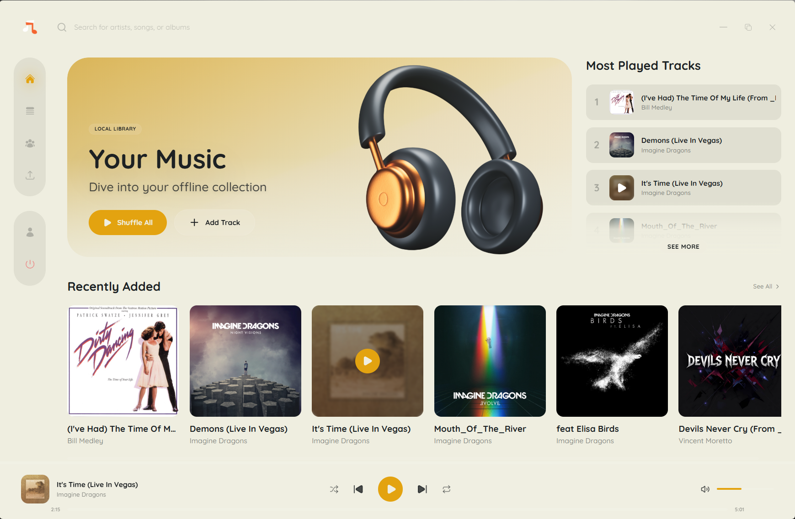
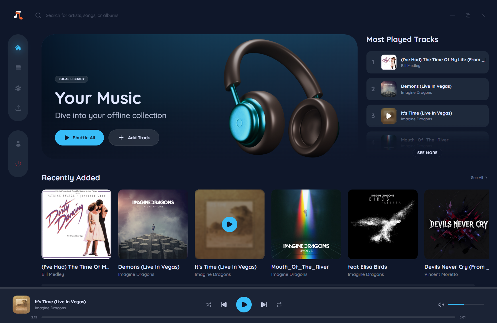
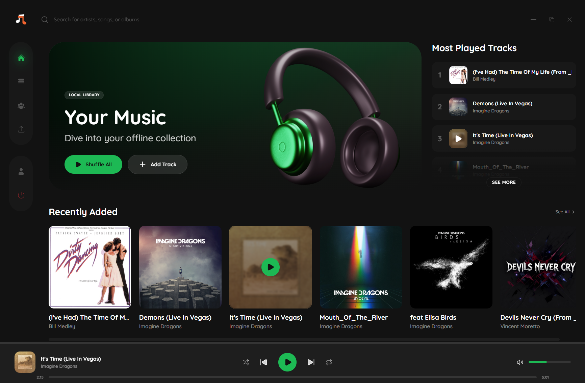
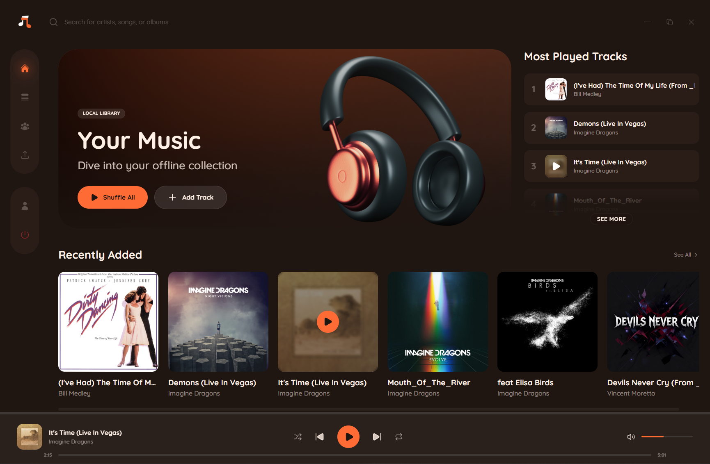
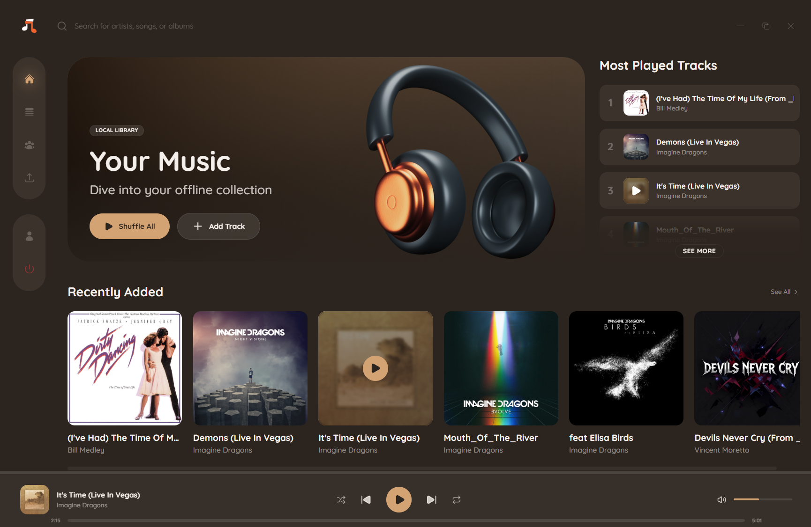

# Awesome Music Player – Premium Desktop Audio Environment

## Overview
**Awesome Music Player** is a high-performance, offline-first desktop music player and library management system. Built for users with extensive local audio collections, Awesome Music Player provides a fluid, aesthetically premium interface combined with a highly optimized, resource-efficient backend. 

The core business value of Awesome Music Player lies in its ability to handle massive local file directories flawlessly, extract metadata reliably, and deliver an uninterrupted, state-persistent listening experience without relying on cloud connectivity.

## Key Features
- **Robust Audio Pipeline -** Proprietary Blob-based audio streaming bypasses standard WebView2 constraints, allowing seamless playback of complex file paths.
- **Blazing Fast Performance -** Powered by Tauri and Rust, the application is incredibly lightweight. It consumes a fraction of the RAM and operates up to 5x faster than traditional Electron-based music players.
- **Persistent Playback State -** Intelligent caching mechanisms ensure that volume, queues, and exact playback timestamps are restored instantly upon application restart.
- **Advanced Library Management -** Instant indexing of audio files (MP3, WAV, FLAC, M4A, OGG) with robust ID3 metadata extraction.
- **Dynamic Search & Navigation -** Categorized real-time search spanning tracks, artists, and playlists, featuring actionable contextual menus.
- **Global Localization -** Comprehensive multi-language support (🇬🇧 English, 🇷🇺 Russian, 🇺🇦 Ukrainian, 🇪🇸 Spanish, 🇫🇷 French, 🇩🇪 German, 🇨🇳 Chinese, 🇯🇵 Japanese) ensuring a native experience for users worldwide.

## Extensive Theming
Awesome Music Player comes with a wide variety of custom themes, allowing you to deeply personalize your audio environment to match your mood and aesthetic.

| | |
|:---:|:---:|
|  |  |
|  |  |
|  |  |

## Technology Stack
- **Frontend Core -** React 19, TypeScript, Vite
- **Styling & UI -** Tailwind CSS v4, Framer Motion, Lucide Icons
- **Backend / Engine -** Tauri v2, Rust
- **Metadata Extraction -** `lofty` (Rust)

## Design Reference
The user interface and overall aesthetic of this project were built using the following Figma mockup as a primary reference:
- [Figma Community - Music Player App Design](https://www.figma.com/community/file/1160523124711138437)

## Installation
You can easily install the latest stable version on your Windows machine:
1. Navigate to the [Releases](https://github.com/S1avv/awesome-music-player/releases) page.
2. Download the latest `Awesome Music Player_*_x64-setup.exe` file from the **Assets** section.
3. Run the installer and follow the standard setup process.

## Documentation Directory
The project documentation is divided into specific modules:

*   [Development Setup (`DEVELOPMENT.md`)](DEVELOPMENT.md)
*   [Deployment & CI/CD (`DEPLOYMENT.md`)](DEPLOYMENT.md)
*   [Product Roadmap (`ROADMAP.md`)](ROADMAP.md)
*   [Contribution Guidelines (`CONTRIBUTING.md`)](CONTRIBUTING.md)
*   [Security Policy (`SECURITY.md`)](SECURITY.md)

## Support & Contact
For business inquiries, enterprise licensing, or technical support, please refer to the internal team contact or open an issue in the issue tracker following the appropriate templates.

---
*Awesome Music Player - Elevating the local audio experience.*
